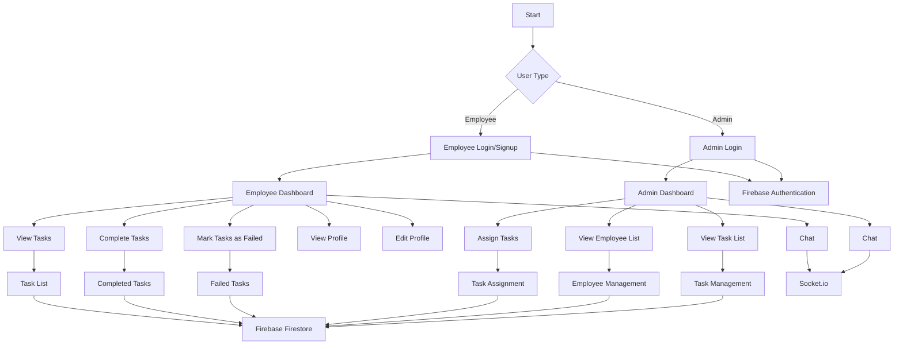

# Employee Management System Flow Chart

```mermaid title="Employee Management System Flow" type="diagram"
graph TD
    A[Start] --> B{User Type}
    B -->|Employee| C[Employee Login/Signup]
    B -->|Admin| D[Admin Login]

    C --> E[Employee Dashboard]
    D --> F[Admin Dashboard]

    E --> G[View Tasks]
    E --> H[Complete Tasks]
    E --> I[Mark Tasks as Failed]


    E --> J[View Profile]
    E --> K[Edit Profile]
    E --> L[Chat]

    F --> M[Assign Tasks]
    F --> N[View Employee List]
    F --> O[View Task List]
    F --> P[Chat]

    G --> Q[Task List]
    H --> R[Completed Tasks]
    I --> S[Failed Tasks]

    M --> T[Task Assignment]
    N --> U[Employee Management]
    O --> V[Task Management]

    Q --> W[Firebase Firestore]
    R --> W
    S --> W
    T --> W
    U --> W
    V --> W

    C --> X[Firebase Authentication]
    D --> X

    L --> Y[Socket.io]
    P --> Y
```
